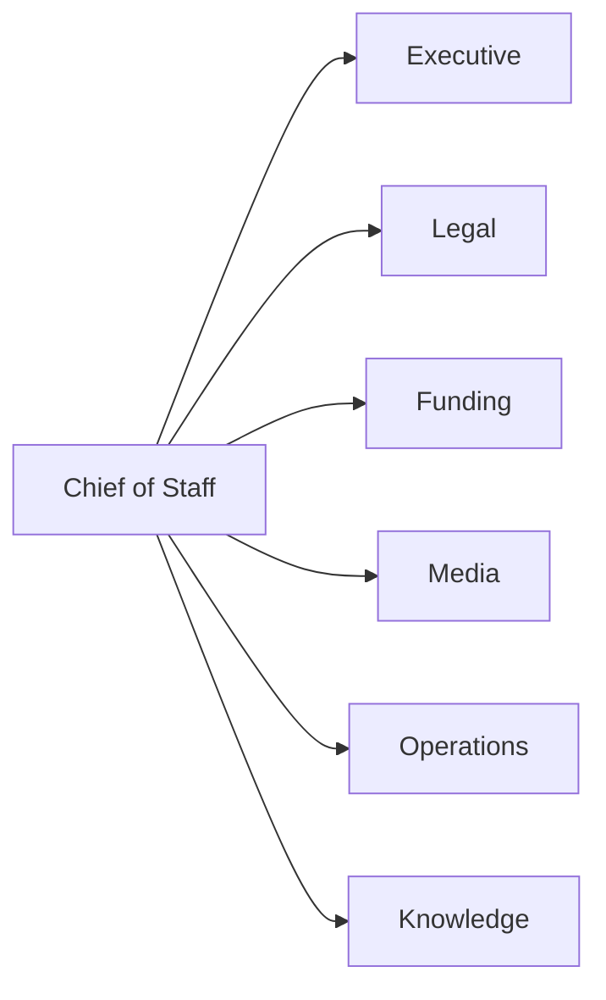

# AI Workforce

The Law Library AI workforce is organized by department. Every recommendation flows through the Chief of Staff before it reaches Executive Command.

## Departments

- **Executive:** Executive Command, Chief of Staff.
- **Legal:** Intake Agent, Case Manager, FOIA Agent, Habeas Agent, Research Agent, Court Monitor.
- **Funding:** Grant Research, Grant Writer, Sponsor Acquisition, Donor Development, Partnership Development, Compliance, Reporting.
- **Media:** Podcast, Newsletter, Social, Course Publishing.
- **Operations:** CRM, Finance, Property, Scheduling.
- **Knowledge:** Knowledge Indexer, Search Agent, Citation Agent, Document Classifier.

## Operating rule

Agents retrieve applicable knowledge, produce structured recommendations, record audit context, and stop at approval gates. Agents do not make legal decisions, submit filings, send emails, spend money, publish content, or submit grants without human approval.
