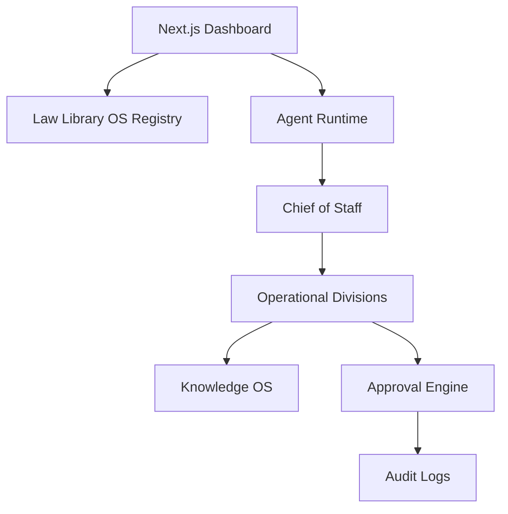

# GAIOS Architecture

GAIOS remains an approval-gated, auditable operating system. Milestone 10 extends the existing dashboard, agent, workflow, knowledge, autonomy, connector, and persistence layers with a Law Library operational registry rather than replacing them.

## Milestone 12: Enterprise Operations & Autonomous Execution

GAIOS now extends the existing production architecture into an enterprise AI operating system without redesigning the platform or duplicating agents.

### Enterprise workspace model

The operating system recognizes eight first-class workspaces: The Law Library, Golding Compound, Relax With Me, YouPassGo, TLC Creations, Musa Links, YardYank, and J&J Catering. Each workspace is organization-scoped and exposes the same operational modules: Organizations, Projects, Tasks, Documents, Knowledge, CRM, Finance, Reporting, Users, and Permissions.

### Executive intelligence

Executive Command synthesizes organization-scoped live records into Morning Briefing, Evening Debrief, Weekly Executive Report, Monthly Strategic Report, Quarterly Board Report, and Annual Organizational Review views. These reports combine tasks, approvals, projects, production records, AI workforce activity, and audit signals instead of listing raw rows.

### Cross-agent collaboration

Chief of Staff remains the coordination layer for structured handoffs including Research to Grant Writing, Research to Legal, CRM to Funding, Funding to Finance, Media to Education, Knowledge to Legal, and Property to Finance. Workflows surface approval gates before any external or high-risk action.

### Knowledge graph

Milestone 12 adds organization-scoped knowledge graph node and edge repositories for People, Organizations, Cases, Grants, Sponsors, Donors, Projects, Meetings, Documents, Programs, Tasks, and Relationships. Graph records retain source-table/source-id metadata for auditability and deterministic provenance.

### Approval-gated automation

Reusable workflow templates now cover grant lifecycle, sponsor lifecycle, case lifecycle, volunteer onboarding, board meetings, project approvals, media production, and course publishing. The workflow runtime registers matching approval-gated workflows and blocks external actions until human approval is recorded.

### Analytics and AI workforce management

Enterprise dashboards expose KPI domains for Funding, Cases, Education, Partnerships, Media, Finance, Operations, Property, and AI Workforce. AI workforce visibility includes agent health, delegations, queues, completed work, recommendations, pending approvals, and execution history.

### Production hardening

All Milestone 12 repositories are organization-scoped, row-level-security enabled, indexed by organization, and designed to degrade safely when optional live data repositories are not populated.
