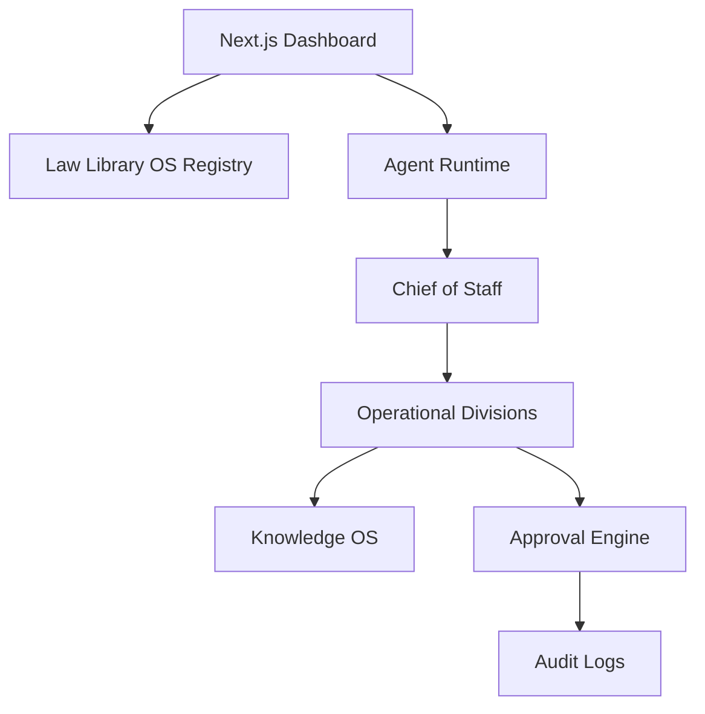

# GAIOS Architecture

GAIOS remains an approval-gated, auditable operating system. Milestone 10 extends the existing dashboard, agent, workflow, knowledge, autonomy, connector, and persistence layers with a Law Library operational registry rather than replacing them.

