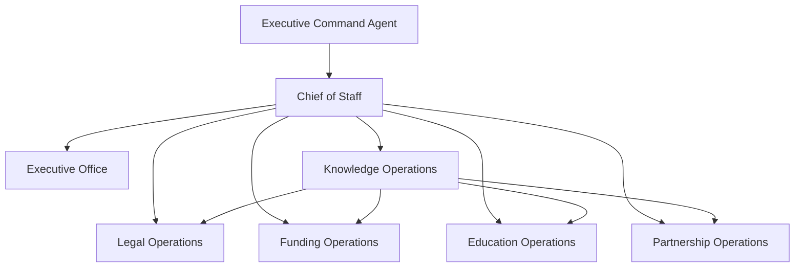

# The Law Library Operating System

Milestone 10 activates the existing GAIOS architecture as a production operating system for The Law Library. The activation layer is intentionally operational: it adds real division boundaries, workflow states, seed structures, natural-language executive commands, and approval gates without redesigning the underlying runtime.

## Production divisions

1. **Executive Office** produces the morning executive briefing, priority queue, urgent cases, hearings, grant deadlines, sponsor and donor pipeline, financial snapshot, property updates, AI recommendations, pending approvals, and system health.
2. **Legal Operations** manages intake, cases, evidence, FOIA, habeas, removal defense, USCIS, EOIR, ICE detention, court calendar, deadlines, document generation, and case timelines. AI never gives legal advice and never submits filings.
3. **Funding Operations** manages grants, sponsors, donors, foundations, corporate partnerships, campaigns, forecasts, revenue dashboards, board reports, impact reports, compliance checklists, and submission queues. Every submission requires approval.
4. **Education Operations** manages Orange Trees & Backyards, Crimmigration Corner, courses, toolkits, workshops, volunteer training, calendars, lesson planning, content production, publishing queues, and approval queues.
5. **Partnership Operations** manages law firms, universities, community organizations, sponsors, corporate partners, foundations, government agencies, volunteers, health scores, follow-ups, relationship timelines, meeting notes, and opportunities.
6. **Knowledge Operations** indexes Google Drive, SOPs, templates, board documents, research, media, property documents, and policies. Agents must retrieve knowledge before drafting responses.

## Safety model

The production layer preserves deterministic execution, organization isolation, audit logging, and role-based access. The following actions are blocked behind explicit human approval:

- Legal filings
- Financial transactions
- Emails
- Publishing
- Grant submissions
- Sponsor outreach

## Data model activation

The seed structures represent production-ready categories without fabricated client data: organizations, programs, cases, clients, grants, sponsors, donors, partners, volunteers, projects, knowledge sources, media assets, tasks, and approvals.

## Executive commands

Executive Command supports deterministic routing for commands such as:

- “Show today’s priorities.”
- “What cases need attention?”
- “Prepare grant briefing.”
- “Generate sponsor report.”
- “Show detainees requiring action.”
- “Prepare board report.”
- “Generate executive summary.”

Every command delegates through the Chief of Staff and returns auditable recommendations or drafts only.
